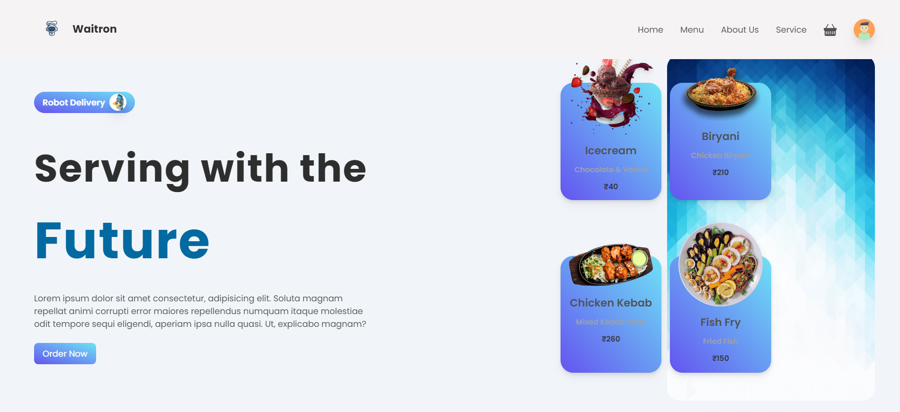

> fullstack Food website for waitron using Reactjs
> [Follow Us]()



# To check the node version

```
node --version
```

# To initialize the Firebase console

```
firebase int
```

# To start the server

```
npm run serve
```

# To start the client

```
npm start
```
